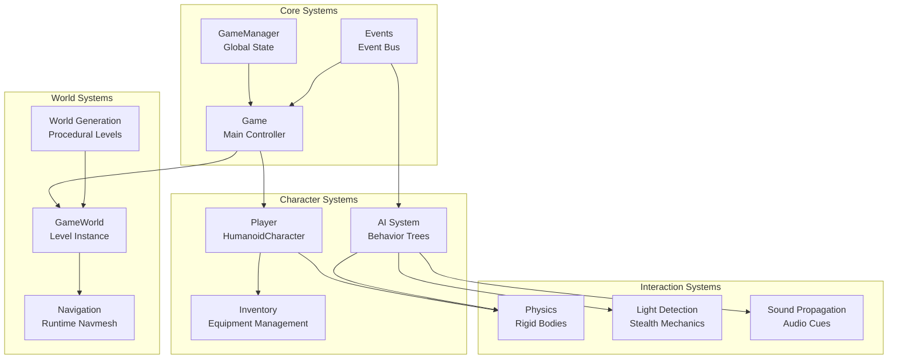
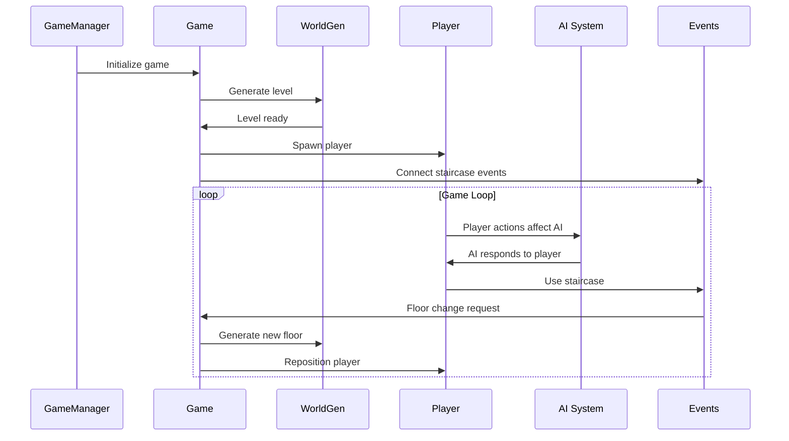
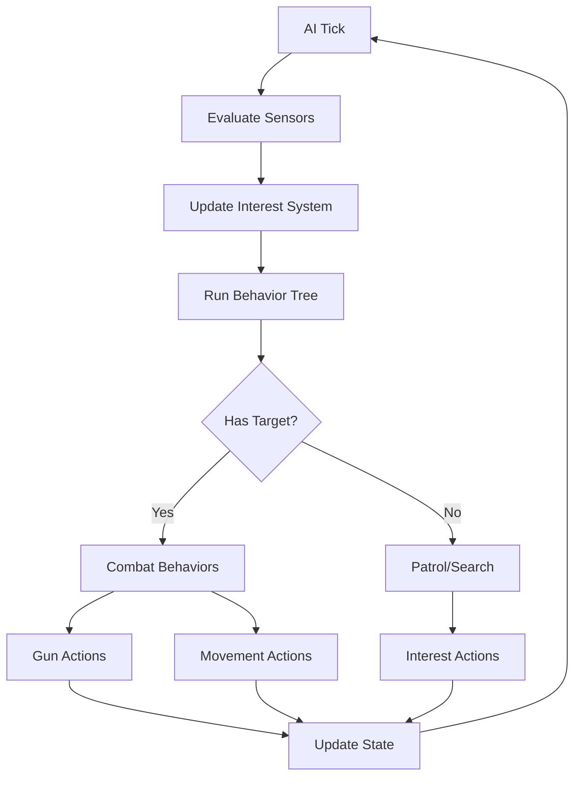
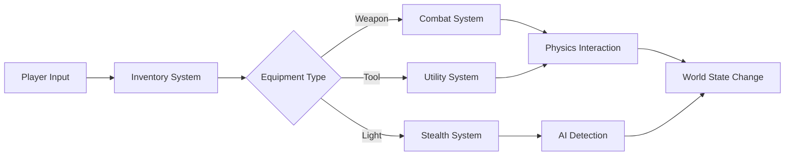

# Secret Histories - Architecture Documentation

## Overview

Secret Histories is a Victorian-era cosmic horror FPS roguelite built in Godot 4, emphasizing systems-driven gameplay over scripted events. The architecture follows a modular design philosophy where every interaction emerges from believable physics and AI behaviors.

**Core Identity**: Victorian-era cosmic horror FPS roguelite with stealth/combat elements  
**Technical Philosophy**: Systems over scripts, emergent gameplay through component interactions  
**License**: Free culture (GPLv3)

## High-Level Architecture



## Core Game Systems

### 1. Game Management System

**Location**: [`globals/game_manager.gd`](globals/game_manager.gd), [`scenes/game.gd`](scenes/game.gd)

The game management system handles the overall game state and flow:

- **GameManager**: Global singleton managing screen filters, acts/chapters, player death state, and world generation RNG
- **Game**: Main game controller managing level loading, player spawning, and floor transitions
- **Floor System**: 5-level dungeon structure (floors -1 to -5) with increasing size and complexity

**Key Features**:
- Floor-based progression with persistent level data via [`FloorLevelHandler`](scenes/worlds/floor_level_handler.gd)
- Dynamic level loading/unloading for memory management
- Staircase-based navigation between floors
- Victory condition: reaching surface with [`ShardOfTheComet`](scenes/objects/pickable_items/equipment/strange_devices/comet_shard/comet_shard.gd)

### 2. AI System (Behavior Trees)

**Location**: [`core/ai/`](core/ai/)

The AI system uses a custom behavior tree implementation for intelligent, goal-driven NPCs:

**Core Components**:
- [`BTRoot`](core/ai/bt_root.gd): Root behavior tree node with tick management
- [`BTNode`](core/ai/bt_node.gd): Base class for all behavior tree nodes
- [`BTAction`](core/ai/bt_action.gd): Action nodes for executable behaviors
- [`BTCheck`](core/ai/bt_check.gd): Condition nodes for decision making
- [`CharacterState`](core/ai/character_state.gd): AI character state management

**Specialized Node Categories**:
- **Flow Nodes**: [`BTSelector`](core/ai/flow_nodes/bt_selector.gd), [`BTSequence`](core/ai/flow_nodes/bt_sequence.gd)
- **Gun Nodes**: Weapon handling ([`bt_gun_shoot.gd`](core/ai/gun_nodes/action_nodes/bt_gun_shoot.gd), [`bt_gun_reload.gd`](core/ai/gun_nodes/action_nodes/bt_gun_reload.gd))
- **Interest Nodes**: Dynamic interest system for AI attention
- **Misc Nodes**: Movement, targeting, and utility behaviors

**AI Philosophy**: Enemies have goals, memories, and dynamic threat assessments. They react intelligently to player actions and environmental changes.

### 3. Character System

**Location**: [`scenes/characters/`](scenes/characters/)

The character system provides a unified framework for both player and NPCs:

**Base Classes**:
- [`HumanoidCharacter`](scenes/characters/humanoid_character_base/humanoid_character.gd): Physics-based character controller using RigidBody3D
- [`Character`](scenes/characters/character.gd): Legacy CharacterBody3D-based character (being phased out)
- [`Player`](scenes/characters/player/player.gd): Player-specific extensions

**Character Components**:
- [`HumanoidCharacterInput`](scenes/characters/humanoid_character_base/humanoid_character_input.gd): Input handling
- [`HumanoidCharacterState`](scenes/characters/humanoid_character_base/humanoid_character_state.gd): Character state management
- [`HumanoidCharacterParameters`](scenes/characters/humanoid_character_base/humanoid_character_parameters.gd): Character configuration
- [`CharacterCollision`](scenes/characters/humanoid_character_base/character_collision.gd): Dynamic collision handling
- [`Inventory`](scenes/characters/inventory.gd): Equipment and item management

**Key Features**:
- Physics-based movement with ground detection and slope handling
- Dynamic crouching and stamina system
- Integrated inventory system with equipment slots
- Kick mechanics for environmental interaction

### 4. World Generation System

**Location**: [`scenes/worlds/world_gen/`](scenes/worlds/world_gen/), [`scenes/worlds/procedural_world/`](scenes/worlds/procedural_world/)

The world generation system creates procedural levels while maintaining a hand-crafted feel:

**Core Components**:
- [`GenerationManager`](scenes/worlds/world_gen/generation_steps/generation_manager.gd): Orchestrates generation pipeline
- [`GenerationStep`](scenes/worlds/world_gen/generation_steps/generation_step.gd): Base class for generation phases
- [`RoomData`](scenes/worlds/world_gen/helper_objects/room_data.gd): Room definitions and metadata
- [`RoomPurpose`](scenes/worlds/world_gen/helper_objects/room_purposes/room_purpose.gd): Room functionality definitions

**Generation Pipeline**:
1. **Room Layout**: Generate room positions and connections
2. **Room Assignment**: Assign purposes based on requirements
3. **Population**: Spawn objects, items, and characters
4. **Navigation**: Generate runtime navmesh for AI pathfinding

**Room System**:
- [`RoomRequirements`](scenes/worlds/world_gen/helper_objects/room_requirements/room_requirements.gd): Size, doorway, and feature requirements
- Purpose-driven room generation (staircases, storage, combat areas)
- Modular grid-based design (1.5m² base unit for OSR D&D compatibility)

### 5. Item and Equipment System

**Location**: [`scenes/objects/pickable_items/`](scenes/objects/pickable_items/)

The item system provides a hierarchical equipment framework:

**Item Hierarchy**:
```
PickableItem (base)
├── TinyItem (ammunition, keys, small tools)
├── EquipmentItem (wearable/usable items)
│   ├── MeleeItem (swords, daggers, clubs)
│   ├── GunItem (firearms with period-appropriate complexity)
│   ├── ToolItem (lanterns, locks, utility items)
│   ├── ConsumableItem (potions, medical supplies, bombs)
│   ├── ContainerItem (bags, boxes, storage)
│   ├── StrangeDevice (supernatural items)
│   └── WritingItem (books, notes, documents)
```

**Key Features**:
- Physics-based item interaction
- Equipment slots with hand-specific assignments
- Victorian-era weapon complexity (optional Receiver-style mechanics)
- Light sources as both tools and stealth mechanics

### 6. Interaction Systems

**Location**: [`scenes/sensors/`](scenes/sensors/), [`scenes/objects/interactables/`](scenes/objects/interactables/)

The interaction system handles player-world communication:

**Sensor System**:
- [`CharacterSense`](scenes/sensors/character_sense.gd): Base sensor class
- [`VisualSensor`](scenes/sensors/visual_sensor.gd): Line-of-sight detection
- [`SoundSensor`](scenes/sensors/sound_sensor.gd): Audio-based detection
- [`TouchSensor`](scenes/sensors/touch_sensor.gd): Physical contact detection
- [`LightArea`](scenes/sensors/light_detection/light_area/light_area.gd): Light-based stealth mechanics

**Interaction Framework**:
- [`Interactable`](scenes/objects/interactables/interactable.gd): Base interactable object
- Physics-based interactions through RigidBody3D
- Environmental storytelling through evidence and clues

## Folder Structure

### Root Level Organization

```
SecretHistories/
├── addons/                    # Third-party plugins and extensions
├── core/                      # Core game systems and utilities
├── globals/                   # Global singletons and autoloads
├── resources/                 # Game assets (art, audio, models, etc.)
├── scenes/                    # Game scenes and prefabs
├── script_templates/          # Custom GDScript templates
└── utils/                     # Utility scripts and debug tools
```

### Core Systems (`core/`)

```
core/
└── ai/                        # AI behavior tree system
    ├── bt_*.gd               # Base behavior tree classes
    ├── debug/                # AI debugging tools
    ├── flow_nodes/           # Control flow nodes (selector, sequence)
    ├── gun_nodes/            # Weapon-specific AI behaviors
    ├── interest_nodes/       # Dynamic interest system
    ├── misc_nodes/           # General utility AI nodes
    └── phold_icons/          # Placeholder icons for editor
```

### Global Systems (`globals/`)

```
globals/
├── events.gd                 # Event bus for decoupled communication
├── game_manager.gd           # Global game state management
├── global_consts.gd          # Game-wide constants
├── groups.gd                 # Node group definitions
├── keybinding_manager.gd     # Input mapping system
├── load_*.gd                 # Loading utilities
├── save.gd                   # Save/load system
├── settings*.gd              # Settings management
└── settings/                 # Settings configuration files
```

### Game Scenes (`scenes/`)

```
scenes/
├── characters/               # Character-related scenes and scripts
│   ├── humanoid_character_base/  # Base humanoid character system
│   ├── player/              # Player-specific implementations
│   ├── cultist/             # Enemy character implementations
│   ├── skeleton_modifiers/  # IK and animation systems
│   └── *.gd                 # Character utilities (inventory, audio, etc.)
├── effects/                  # Visual and particle effects
├── objects/                  # Interactive world objects
│   ├── interactables/       # Base interactable system
│   ├── large_objects/       # Furniture, doors, decorations
│   └── pickable_items/      # Item hierarchy and implementations
├── sensors/                  # Detection and sensing systems
├── ui/                      # User interface components
└── worlds/                  # World and level systems
    ├── procedural_world/    # Procedural generation implementation
    ├── world_gen/           # Generation pipeline and tools
    └── *.gd                 # World utilities and base classes
```

### Resources (`resources/`)

```
resources/
├── animations/              # Character and object animations
├── art/                     # 2D artwork and textures
│   ├── game_intro/         # Intro sequence artwork
│   ├── health/             # UI health indicators
│   ├── opening_screens/    # Menu and loading screens
│   └── player ui/          # Player interface elements
├── effects/                 # Particle effects and shaders
├── fonts/                   # Typography resources
├── inventory/               # Item icons and UI elements
├── mesh_libraries/          # Reusable mesh collections
├── models/                  # 3D models organized by category
│   ├── characters/         # Character models and rigs
│   ├── gridmap/            # Modular level pieces
│   ├── items/              # Item models by type
│   └── large_objects/      # Furniture and decoration models
└── shaders/                 # Custom shader implementations
```

### Utilities (`utils/`)

```
utils/
├── debug_scenes/            # Debug and testing scenes
├── tool/                    # Editor tools and utilities
└── *.gd                     # Utility scripts and helpers
```

## System Interactions and Data Flow

### Game Flow Architecture



### AI Decision Flow



### Equipment System Flow



## Coding Patterns and Conventions

### Architecture Patterns

1. **Component-Based Design**: Characters use composition with separate components for input, state, parameters, and collision
2. **Event-Driven Communication**: [`Events`](globals/events.gd) singleton provides decoupled system communication
3. **Behavior Trees**: AI uses hierarchical behavior trees for complex, reusable decision-making
4. **Physics-First**: All interactions use Godot's physics system for emergent gameplay
5. **Resource-Based Configuration**: Extensive use of Godot resources for data-driven design

### Code Style Guidelines

Following [`CODE_STYLE.md`](CODE_STYLE.md):

- **Naming**: snake_case for files/functions, PascalCase for classes, CONSTANT_CASE for constants
- **Typing**: Static typing with `var name: Type` or `:=` inference
- **Structure**: Modular, extensible, maintainable code with clear separation of concerns
- **Comments**: `##` for documentation, `#` for regular comments

### Common Patterns

**Singleton Pattern**: Global systems use autoload singletons
```gdscript
# globals/game_manager.gd
extends Node
var game: Game
```

**Component Pattern**: Character systems use composition
```gdscript
# HumanoidCharacter components
@onready var parameters: HumanoidCharacterParameters = $Parameters
@onready var state: HumanoidCharacterState = $State
@onready var input: HumanoidCharacterInput = $Input
```

**Observer Pattern**: Event bus for decoupled communication
```gdscript
# Signal emission
Events.emit_signal("up_staircase_used")
# Signal connection
Events.connect("up_staircase_used", Callable(self, "_on_staircase_used"))
```

## Development Guidelines

### Adding New Content

**New Enemy Types**:
1. Extend [`HumanoidCharacter`](scenes/characters/humanoid_character_base/humanoid_character.gd) or [`Character`](scenes/characters/character.gd)
2. Create behavior tree using existing AI nodes in [`core/ai/`](core/ai/)
3. Add character-specific sensors in [`scenes/sensors/`](scenes/sensors/)
4. Configure spawn data in [`scenes/worlds/procedural_world/`](scenes/worlds/procedural_world/)

**New Items**:
1. Choose appropriate base class from item hierarchy
2. Create 3D model and place in [`resources/models/items/`](resources/models/items/)
3. Implement item-specific behavior (combat, utility, etc.)
4. Add to spawn lists in world generation system

**New Room Types**:
1. Create [`RoomPurpose`](scenes/worlds/world_gen/helper_objects/room_purposes/room_purpose.gd) resource
2. Define [`RoomRequirements`](scenes/worlds/world_gen/helper_objects/room_requirements/room_requirements.gd)
3. Add population logic to generation pipeline
4. Create modular pieces in [`resources/models/gridmap/`](resources/models/gridmap/)

### Performance Considerations

- **Level Streaming**: Use [`FloorLevelHandler`](scenes/worlds/floor_level_handler.gd) for memory management
- **AI Optimization**: Behavior trees tick at configurable intervals
- **Physics Optimization**: Use appropriate collision layers and RigidBody3D sleep states
- **Rendering**: Implement visibility culling and LOD systems for large levels

### Debugging Tools

- **AI Debug View**: [`ai_debug_view.gd`](core/ai/debug/ai_debug_view.gd) for behavior tree visualization
- **Debug Scenes**: [`utils/debug_scenes/`](utils/debug_scenes/) for isolated testing
- **Room Graph Visualization**: [`room_graph_viz.gd`](utils/debug_scenes/room_graph_viz/room_graph_viz.gd) for level layout debugging

### Extension Points

The architecture supports several extension points for modding and additional content:

1. **Behavior Tree Nodes**: Add new AI behaviors by extending [`BTAction`](core/ai/bt_action.gd) or [`BTCheck`](core/ai/bt_check.gd)
2. **Generation Steps**: Extend [`GenerationStep`](scenes/worlds/world_gen/generation_steps/generation_step.gd) for custom world generation
3. **Item Types**: Extend the item hierarchy for new equipment categories
4. **Sensor Types**: Create new detection systems by extending [`CharacterSense`](scenes/sensors/character_sense.gd)
5. **Effect System**: Add visual effects using [`Effect`](scenes/effects/effects.gd) base class

## Technical Specifications

- **Engine**: Godot 4.x
- **Language**: GDScript with static typing
- **Physics**: 3D RigidBody-based character controller
- **AI**: Custom behavior tree implementation
- **World**: Procedural generation with runtime navmesh
- **Grid Unit**: 1.5m² (compatible with OSR D&D systems)
- **Target Platforms**: PC (Linux, Windows, macOS)

## Future Architecture Considerations

- **Multiplayer**: Co-op support planned with shared vulnerability mechanics
- **Modding Support**: OSR D&D and fantasy/sci-fi genre expansion
- **Performance Scaling**: Large dungeon optimization for deeper floors
- **Save System**: Persistent world state and knowledge progression
- **Audio System**: 3D spatial audio for enhanced stealth mechanics

---

*This document serves as the primary architectural reference for Secret Histories development. Keep it updated as systems evolve and new components are added.*